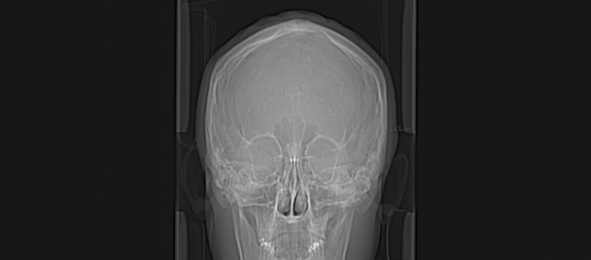
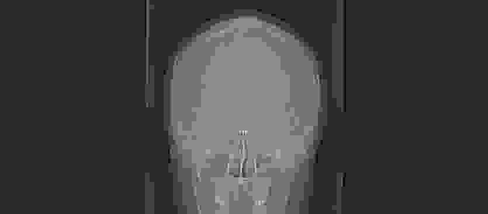
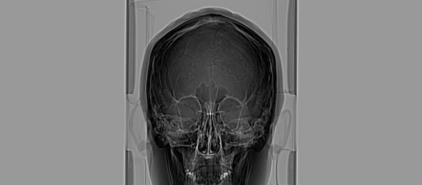
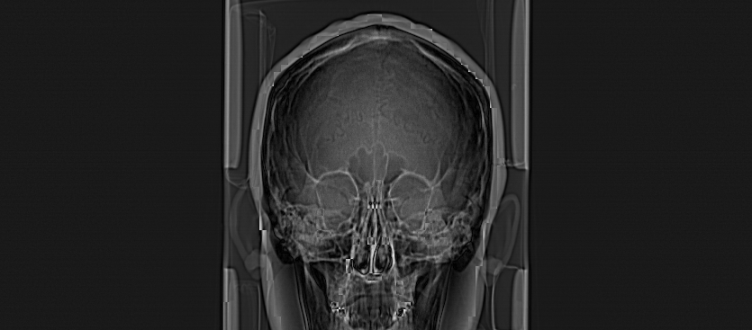
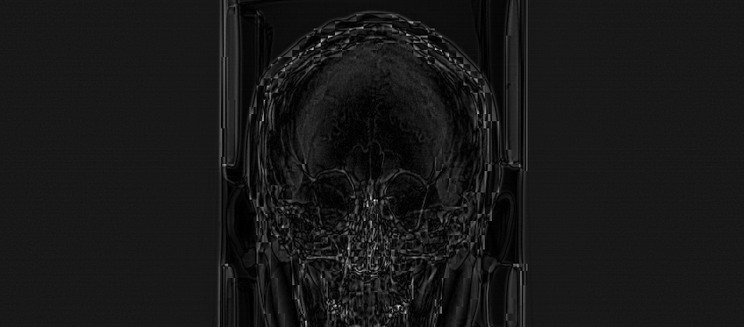

# MEDC: Medical Image Codec

A lossy compression system for 16-bit medical images using DCT-based transform coding.

## Overview

MEDC (Medical Image Codec) is an end-to-end compression system designed for CT/MR images with greater than 8-bit depth. The codec implements:

- 8x8 Block DCT (Discrete Cosine Transform)
- Uniform Quantization adapted for 16-bit dynamic range
- Huffman Entropy Coding with DC DPCM and AC RLE
- Custom binary bitstream format with CRC32 verification

### System Architecture

```
                            ENCODER
    +--------+    +-------+    +-----+    +------+    +---------+
    | Input  | -> | Level | -> | DCT | -> | Quant| -> | Entropy | -> .mcd
    | int16  |    | Shift |    | 8x8 |    |      |    | Coding  |
    +--------+    +-------+    +-----+    +------+    +---------+

                            DECODER
    +--------+    +---------+    +-------+    +------+    +--------+
    |  .mcd  | -> | Entropy | -> | De-   | -> | IDCT | -> | Output |
    |        |    | Decode  |    | Quant |    | 8x8  |    | int16  |
    +--------+    +---------+    +-------+    +------+    +--------+
```

---

## Quick Start (Recommended)

Use the provided scripts to set up and run the project on a clean environment:

```bash
# 1. Setup environment (creates conda environment and installs dependencies)
./setup.sh

# 2. Activate environment
conda activate medcodec

# 3. Run all tests
./run_tests.sh

# 4. Run experiments
./run_experiments.sh
```

Alternatively, use Makefile commands:

```bash
make setup      # Set up conda environment
make test       # Run all checkpoint tests
make experiment # Run compression experiments
make demo       # Run a quick demo encode/decode
make clean      # Clean temporary files
make all        # Run everything (test + experiment)
```

---

## Environment Setup

### Requirements

- Python 3.8+
- NumPy
- PyDICOM (for reading DICOM files)
- pylibjpeg + pylibjpeg-libjpeg (for JPEG2000 compressed DICOM)
- Pillow (for image visualization)
- Matplotlib (for generating figures)

### Installation

**Option 1: Using Conda (Recommended)**

```bash
# Create new environment
conda create -n medcodec python=3.10 -y
conda activate medcodec

# Install dependencies
pip install numpy pydicom pylibjpeg pylibjpeg-libjpeg pillow matplotlib
```

**Option 2: Using pip**

```bash
# Create virtual environment
python -m venv venv
source venv/bin/activate  # Linux/Mac
# or
.\venv\Scripts\activate   # Windows

# Install dependencies
pip install -r requirements.txt
```

### Verify Installation

```bash
# Run all checkpoint tests
python tests/test_checkpoint_1.py
python tests/test_checkpoint_2.py
python tests/test_checkpoint_3.py
python tests/test_checkpoint_4.py
python tests/test_checkpoint_5.py
python tests/test_checkpoint_6.py
python tests/test_checkpoint_7.py
```

All tests should display "PASSED".

---

## Usage

### Basic Encoding

```bash
# Encode a DICOM file
python encode.py --input data/2_skull_ct/DICOM/I0 --output compressed.mcd --quality 75

# Encode a NumPy file
python encode.py --input image.npy --output compressed.mcd --quality 50

# With verbose output
python encode.py -i input.dcm -o output.mcd -q 85 --verbose
```

### Basic Decoding

```bash
# Decode to NumPy format
python decode.py --input compressed.mcd --output recovered.npy

# With verbose output
python decode.py -i compressed.mcd -o recovered.npy --verbose
```

### Quality Parameter

The `--quality` parameter controls the compression-quality tradeoff:

| Quality | Description                     | Use Case             |
| ------- | ------------------------------- | -------------------- |
| 1-25    | High compression, lower quality | Archival, thumbnails |
| 26-50   | Balanced                        | General purpose      |
| 51-85   | Low compression, high quality   | Diagnostic viewing   |
| 86-100  | Near-lossless                   | Critical analysis    |

---

## Running Experiments

### Step 1: Prepare Test Data

Download test images from [Medimodel Sample DICOM Files](https://medimodel.com/sample-dicom-files/):

```bash
# Create data directory
mkdir -p data/2_skull_ct/DICOM

# Place DICOM files in the directory
# Expected: data/2_skull_ct/DICOM/I0, I1, I2, ...
```

### Step 2: Run Full Experiment Suite

```bash
# Generate metrics.json and output images
python scripts/run_experiments.py
```

This will:

1. Load the CT skull image
2. Compress at Q=25, Q=50, Q=85
3. Calculate RMSE, PSNR, BPP, Compression Ratio
4. Run ablation study (with/without DC DPCM)
5. Save results to `results/metrics.json`
6. Save images to `results/images/`

### Step 3: Run Individual Checkpoint Tests

```bash
# Test I/O and level shift
python tests/test_checkpoint_1.py

# Test DCT transform
python tests/test_checkpoint_2.py

# Test quantization
python tests/test_checkpoint_3.py

# Test entropy coding
python tests/test_checkpoint_4.py

# Test full codec integration
python tests/test_checkpoint_5.py

# Test CLI interface
python tests/test_checkpoint_6.py

# Test evaluation metrics
python tests/test_checkpoint_7.py
```

### Step 4: Generate Report Figures

```bash
cd report
python generate_figures.py
```

---

## Results

### Rate-Distortion Performance

Experiments conducted on CT Skull Image (367 x 835 pixels, 16-bit, 612,890 bytes):

| Quality | RMSE   | PSNR (dB) | BPP    | Compressed Size | Compression Ratio |
| ------- | ------ | --------- | ------ | --------------- | ----------------- |
| 25      | 312.36 | 46.44     | 0.0329 | 1,259 bytes     | 486.81x           |
| 50      | 91.81  | 57.07     | 0.0340 | 1,301 bytes     | 471.09x           |
| 85      | 43.06  | 63.65     | 0.0403 | 1,544 bytes     | 396.95x           |

### Visual Results

#### Original vs Reconstructed

**Original CT Image:**



The original 16-bit CT skull image showing bone structures and soft tissue. Pixel values represent Hounsfield Units (HU) ranging from -464 to 602.

**Reconstructed at Q=85:**



High-quality reconstruction with minimal visible artifacts. PSNR = 63.65 dB indicates excellent preservation of image details.

---

#### Error Maps

Error maps show the absolute difference between original and reconstructed images. Brighter pixels indicate larger reconstruction errors.

**Q=25 (High Compression):**



- Maximum Error: 605 HU
- Mean Error: 291.47 HU
- Errors concentrated in high-frequency regions (edges, fine details)

**Q=50 (Balanced):**



- Maximum Error: 502 HU
- Mean Error: 77.21 HU
- Significant reduction in error magnitude compared to Q=25

**Q=85 (High Quality):**



- Maximum Error: 400 HU
- Mean Error: 37.83 HU
- Errors are minimal and uniformly distributed

---

### Understanding the Results

#### Why Such High Compression Ratios?

The CT skull image achieves 400-486x compression because:

1. **Low Dynamic Range**: The image uses only a small portion of the 16-bit range (values -464 to 602, spanning ~1066 values out of 65536 possible)

2. **Smooth Regions**: Large areas of similar intensity (air, soft tissue) compress very efficiently with DCT

3. **DC DPCM Effectiveness**: Adjacent blocks have similar average values, making differential coding highly effective

#### Interpreting PSNR Values

For 16-bit medical images (MAX = 65535):

| PSNR Range | Quality Assessment       |
| ---------- | ------------------------ |
| < 40 dB    | Noticeable degradation   |
| 40-50 dB   | Good quality             |
| 50-60 dB   | Very good quality        |
| > 60 dB    | Excellent, near-lossless |

Our results (46-64 dB) indicate good to excellent reconstruction quality.

#### Error Map Interpretation

The error maps reveal:

- **Edge Enhancement**: Errors are highest at bone/tissue boundaries where high-frequency content is lost during quantization
- **Uniform Background**: Smooth regions (air, uniform tissue) have near-zero error
- **Quality Scaling**: Higher quality settings reduce both maximum and mean errors proportionally

---

### Ablation Study: DC DPCM Effect

Comparison of compression with and without DC coefficient differential coding:

| Quality | With DPCM   | Without DPCM | Savings |
| ------- | ----------- | ------------ | ------- |
| 25      | 1,259 bytes | 4,874 bytes  | 74.17%  |
| 50      | 1,301 bytes | 5,478 bytes  | 76.25%  |
| 85      | 1,544 bytes | 6,815 bytes  | 77.34%  |

**Conclusion**: DC DPCM provides 74-77% reduction in file size by exploiting the strong correlation between adjacent block DC values.

---

## Project Structure

```
HW2/
├── setup.sh                         # Environment setup script
├── run_tests.sh                     # Run all checkpoint tests
├── run_experiments.sh               # Run experiments
├── Makefile                         # Make commands
├── encode.py                        # CLI encoder
├── decode.py                        # CLI decoder
├── requirements.txt                 # Python dependencies
├── medcodec/                        # Core library
│   ├── __init__.py
│   ├── constants.py                 # Magic number, header format
│   ├── io/                          # Bitstream, image I/O
│   │   ├── bitstream.py
│   │   ├── image_reader.py
│   │   └── image_writer.py
│   ├── transform/                   # DCT, level shift
│   │   ├── dct.py
│   │   ├── block_utils.py
│   │   └── level_shift.py
│   ├── quantization/                # Uniform quantizer
│   │   └── uniform_quantizer.py
│   ├── entropy/                     # Huffman, RLE, DPCM
│   │   ├── huffman.py
│   │   ├── rle.py
│   │   ├── dpcm.py
│   │   └── zigzag.py
│   ├── codec/                       # Encoder/Decoder
│   │   ├── encoder.py
│   │   └── decoder.py
│   └── metrics/                     # Quality metrics
│       └── quality.py
├── tests/                           # Checkpoint tests
├── scripts/                         # Experiment scripts
├── results/                         # Output results
│   ├── metrics.json
│   └── images/
└── MMIP-HW2_IanTsai_313553058.pdf   # Final report
```

---

## Bitstream Format

### File Structure

```
+------------------+
|  Header (20B)    |  Fixed size, contains metadata
+------------------+
|  Payload         |  Variable size, Huffman tables + coded data
+------------------+
|  CRC32 (4B)      |  Integrity check
+------------------+
```

### Header Fields

| Offset | Field       | Size | Description        |
| ------ | ----------- | ---- | ------------------ |
| 0      | Magic       | 4B   | `MEDC`             |
| 4      | Version     | 1B   | `0x01`             |
| 5      | Height      | 2B   | Image height       |
| 7      | Width       | 2B   | Image width        |
| 9      | Bit Depth   | 1B   | Original bit depth |
| 10     | Quality     | 1B   | Quality parameter  |
| 11     | Padding H   | 2B   | Vertical padding   |
| 13     | Padding W   | 2B   | Horizontal padding |
| 15     | Data Length | 4B   | Payload size       |
| 19     | Flags       | 1B   | Bit 0: DPCM flag   |

---

## Limitations

1. **2D Only**: No inter-slice prediction for 3D volumes
2. **Fixed Block Size**: Only 8x8 blocks supported
3. **No ROI Support**: Uniform quality across entire image
4. **Dynamic Huffman**: Tables stored per-file (overhead for small images)

---
